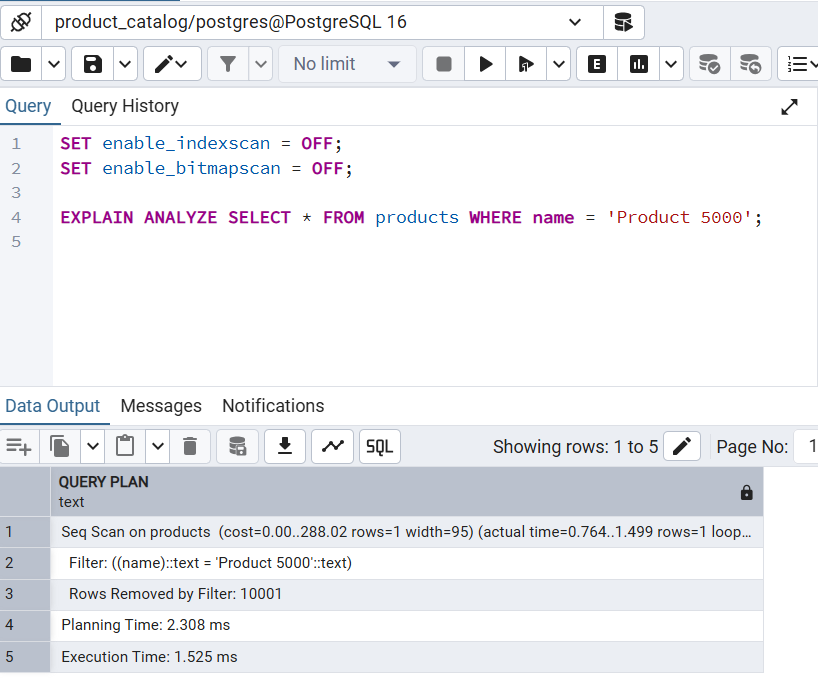
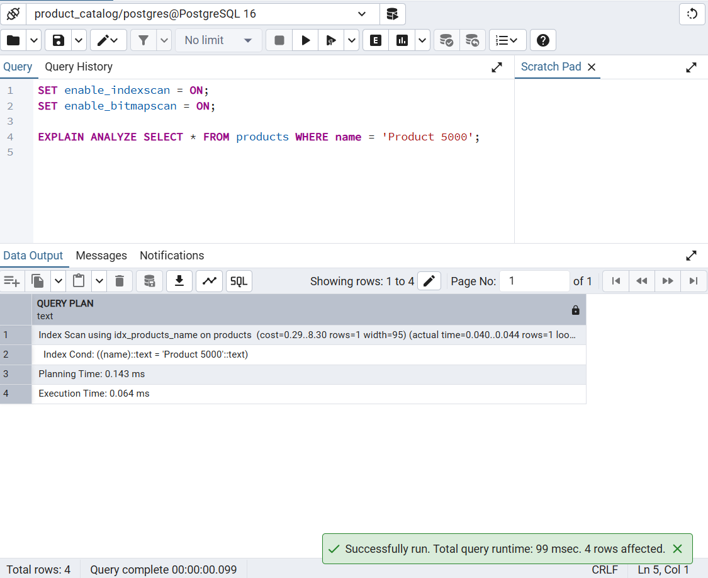

# Product Catalog API — Database Indexing & Query Optimization

REST API berbasis Spring Boot yang dibangun untuk mengeksplorasi dan mengimplementasikan teknik optimasi performa database pada mock product catalog e-commerce.

## Tech Stack

- **Java 21**
- **Spring Boot 4.0.3**
- **Spring Data JPA + Hibernate**
- **PostgreSQL**
- **Lombok**
- **Springdoc OpenAPI (Swagger UI)**

---

## Apa yang Dipelajari di Project Ini

Project ini berfokus pada teknik optimasi performa backend, bukan sekadar CRUD biasa. Berikut topik yang diimplementasikan secara langsung:

### 1. B-Tree Database Indexing
Index didefinisikan langsung di entity `Product` menggunakan anotasi JPA `@Index`, yang menginstruksikan Hibernate untuk membuat index PostgreSQL yang sesuai saat startup.

```java
@Table(name = "products", indexes = {
    @Index(name = "idx_products_name", columnList = "name"),
    @Index(name = "idx_products_category_price", columnList = "category_id, price")
})
```

- **Single column index** pada `name` — mengoptimalkan pencarian produk berdasarkan nama
- **Composite index** pada `category_id, price` — mengoptimalkan filter berdasarkan kategori + rentang harga menggunakan aturan leftmost prefix

### 2. Analisis Performa Query dengan EXPLAIN ANALYZE
Menggunakan perintah `EXPLAIN ANALYZE` PostgreSQL untuk mengukur dan membandingkan performa query sebelum dan sesudah penerapan index.

**Tanpa Index — Sequential Scan**



PostgreSQL membaca semua 10.001 baris, membuang 10.001 yang tidak cocok, mengembalikan 1 hasil. Execution time: **1.525 ms**

**Dengan Index — Index Scan**



PostgreSQL langsung melompat ke baris yang cocok menggunakan `idx_products_name`. Execution time: **0.064 ms**

| Kondisi | Metode | Baris Dibaca | Execution Time |
|---|---|---|---|
| Tanpa index | Seq Scan | 10.001 | 1.525 ms |
| Dengan index | Index Scan | Langsung ke target | 0.064 ms |

**24x lebih cepat** pada 10.000 data. Perbedaannya semakin besar seiring bertambahnya volume data.

### 3. N+1 Query Problem & Solusinya
Masalah N+1 terjadi ketika Hibernate mengirimkan satu query tambahan per baris untuk memuat relasi lazy — dalam kasus ini `Product → Category`.

**Sebelum fix:** 1 query untuk products + N query untuk categories = total N+1 query

**Solusi:** `@EntityGraph` pada method repository memaksa Hibernate menggunakan satu query `LEFT JOIN` alih-alih N+1 query terpisah.

```java
@EntityGraph(attributePaths = {"category"})
@Query("SELECT p FROM Product p")
Page<Product> findAllWithCategory(Pageable pageable);
```

**Setelah fix:** Selalu 2 query saja tanpa peduli ukuran halaman — satu untuk data, satu untuk count.

### 4. Efficient Pagination
Pagination dioptimalkan di level controller untuk mencegah penyalahgunaan dan memastikan hanya kolom yang sudah di-index yang digunakan untuk sorting.

```java
// Batasi maksimum page size untuk mencegah query OFFSET yang besar
size = Math.min(size, 100);

// Whitelist sortBy hanya ke kolom yang memiliki index
if (!List.of("id", "name", "price").contains(sortBy)) {
    sortBy = "id";
}
```

**Mengapa ini penting:**
- Request `size=10000` memaksa PostgreSQL untuk membaca dan melewati ribuan baris
- Sorting berdasarkan kolom tanpa index (misal `description`, `stock`) menyebabkan full table sort sebelum pagination

---

## Struktur Project

```
src/main/java/com/example/LearnQueryOptimization/
├── controller/
│   ├── CategoryController.java
│   └── ProductController.java
├── service/
│   ├── CategoryService.java
│   ├── ProductService.java
│   └── impl/
│       ├── CategoryServiceImpl.java
│       └── ProductServiceImpl.java
├── repository/
│   ├── CategoryRepository.java
│   └── ProductRepository.java
├── entity/
│   ├── Category.java
│   └── Product.java
├── dto/
│   ├── request/
│   │   ├── CategoryRequest.java
│   │   └── ProductRequest.java
│   └── response/
│       ├── ApiResponse.java
│       ├── PageResponse.java
│       ├── CategoryResponse.java
│       └── ProductResponse.java
└── exception/
    ├── ResourceNotFoundException.java
    └── GlobalExceptionHandler.java
```

---

## API Endpoints

### Category
| Method | Endpoint | Deskripsi |
|---|---|---|
| GET | `/api/categories` | Ambil semua kategori (paginasi) |
| GET | `/api/categories/{id}` | Ambil kategori berdasarkan ID |
| POST | `/api/categories` | Buat kategori baru |
| PUT | `/api/categories/{id}` | Update kategori |
| DELETE | `/api/categories/{id}` | Hapus kategori |

### Product
| Method | Endpoint | Deskripsi |
|---|---|---|
| GET | `/api/products` | Ambil semua produk (paginasi) |
| GET | `/api/products/{id}` | Ambil produk berdasarkan ID |
| POST | `/api/products` | Buat produk baru |
| PUT | `/api/products/{id}` | Update produk |
| DELETE | `/api/products/{id}` | Hapus produk |

#### Query Parameters untuk GET `/api/products`
| Parameter | Default | Deskripsi |
|---|---|---|
| `page` | `0` | Nomor halaman (0-based) |
| `size` | `10` | Ukuran halaman (maks: 100) |
| `sortBy` | `id` | Kolom pengurutan (`id`, `name`, `price` saja) |
| `direction` | `asc` | Arah pengurutan (`asc` atau `desc`) |

---

## Cara Menjalankan Secara Lokal

### Prasyarat
- Java 21
- PostgreSQL berjalan di `localhost:5432`
- Database bernama `product_catalog`

### Setup

1. Clone repositori
```bash
git clone <repo-url>
cd LearnQueryOptimization
```

2. Konfigurasi kredensial database di `src/main/resources/application.properties`
```properties
spring.datasource.url=jdbc:postgresql://localhost:5432/product_catalog
spring.datasource.username=your_username
spring.datasource.password=your_password
```

3. Jalankan aplikasi
```bash
./mvnw spring:boot:run
```

4. Seed data dummy (opsional, untuk pengujian performa)

Buka `src/main/resources/data-seed.sql` di PostgreSQL client dan eksekusi. Script ini memasukkan 5 kategori dan 10.000 produk untuk pengujian `EXPLAIN ANALYZE`.

5. Akses Swagger UI di `http://localhost:8080/swagger-ui.html`

---

## Kesimpulan

> Optimasi bukan tentang menambahkan index sebanyak-banyaknya — melainkan menambahkan index yang **tepat** sesuai pola query yang sebenarnya, dan memahami trade-off antara kecepatan baca dan overhead penulisan.

- Index mempercepat `SELECT` namun menambah overhead pada `INSERT`/`UPDATE`/`DELETE`
- Composite index mengikuti **aturan leftmost prefix** — urutan kolom sangat penting
- `FetchType.LAZY` adalah default yang tepat, namun membutuhkan `@EntityGraph` ketika relasi selalu dibutuhkan di response
- `EXPLAIN ANALYZE` adalah kebenaran mutlak — jangan berasumsi, selalu ukur
